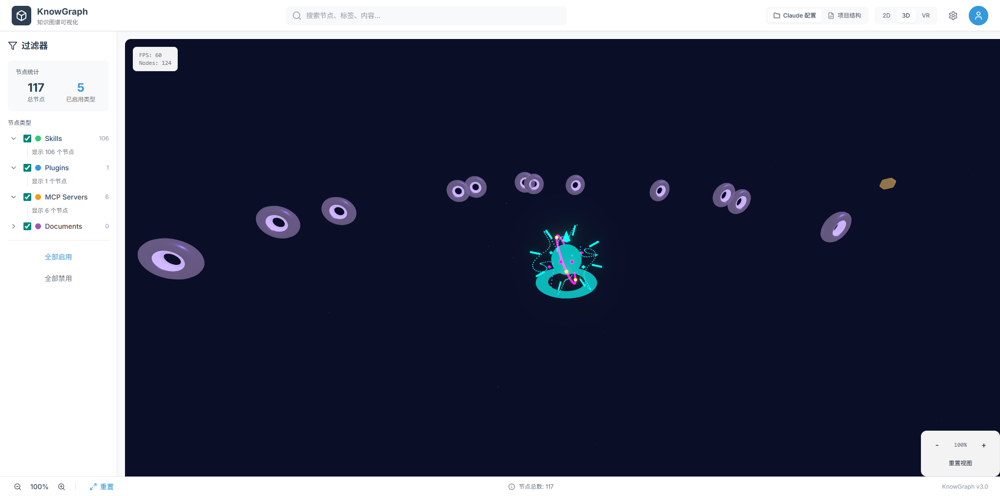

# LLM REconstruction3D Visualization

A 3D visualization tool that renders your local **Claude Code** configuration as an interactive knowledge graph. See your skills, MCP servers, plugins, hooks, rules, agents, and memory as orbital nodes in a cyberpunk-themed 3D space.



## What It Does

This tool reads your local `~/.claude/settings.json` and scans the `~/.claude/` directory to build a real-time 3D visualization of how Claude Code is configured on your machine:

- **Center Node**: Claude Code core
- **Hooks Layer**: PreToolUse, PostToolUse, Stop hooks that intercept tool calls
- **Category Nodes**: Skills, MCP Servers, Plugins, Rules, Agents, Memory, Hook Items
- **Resource Nodes**: Individual items within each category

Hover over categories to reveal connections. Click nodes for details. Select the Hooks Layer to see the full hook architecture.

## Quick Start

```bash
git clone https://github.com/Arxchibobo/LLM-REconstruction3d-Visualization.git
cd LLM-REconstruction3d-Visualization

npm install
cp .env.example .env.local
npm run dev
```

Open `http://localhost:3000` in your browser.

The app auto-detects your Claude config from `~/.claude/`. To override, set `NEXT_PUBLIC_CLAUDE_CONFIG_PATH` in `.env.local`.

## Tech Stack

| Layer | Technology |
|-------|-----------|
| Framework | Next.js 14, React 18, TypeScript 5.3 |
| 3D Rendering | Three.js, React Three Fiber, @react-three/drei |
| Post-processing | @react-three/postprocessing (Bloom effects) |
| State | Zustand 4.5 |
| Styling | Tailwind CSS 3.4 |
| UI Components | Radix UI, Lucide React icons |
| Layout | Custom orbital/engineering layout system |

## Architecture

```
src/
  app/
    v3/page.tsx           # Main page entry
    api/claude-config/    # API route - loads Claude config from filesystem
    api/project-structure/# API route - project structure scanning
  components/
    scene/                # 3D scene components (Three.js)
      KnowledgeGraph.tsx  # Main graph renderer with connection lines
      HooksLayerDetail.tsx# Hooks layer visualization
      CenterRobot.tsx     # Center node with animations
      PlanetNode.tsx      # Individual node renderer
      ParticleField.tsx   # Background particles
      GridFloor.tsx       # Ground grid
    ui-v3/               # V3 cyberpunk UI panels
  services/
    claude/ClaudeConfigService.ts  # Config loading + node conversion
  stores/
    useKnowledgeStore.ts  # Main Zustand store
  adapters/               # Data source adapters (claude-config, project-structure)
  utils/
    engineeringLayout.ts  # 3-tier orbital layout algorithm
    layout.ts             # Layout computation entry point
```

## Configuration

### Environment Variables

| Variable | Description | Default |
|----------|-------------|---------|
| `NEXT_PUBLIC_CLAUDE_CONFIG_PATH` | Path to `.claude` directory | Auto-detected from `~` |
| `CLAUDE_CONFIG_API_KEY` | API key for local auth | `dev-only-key` |
| `NEXT_PUBLIC_CLAUDE_CONFIG_API_KEY` | Client-side API key | `dev-only-key` |

### What Gets Visualized

The tool reads from your Claude Code configuration:

- `settings.json` - Skills, MCP servers, plugins, hooks
- `rules/` directory - Markdown rule files
- `agents/` directory - Agent configurations
- `skills/` directory - Local skill definitions
- `learning/`, `cache/`, `history.jsonl` - Memory items

## License

MIT
