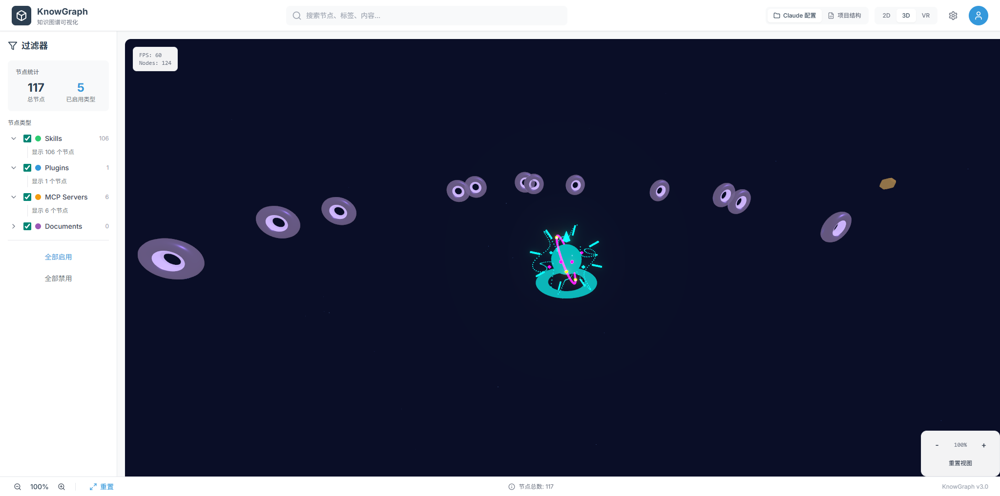

# LLM REconstruction3D Visualization

A 3D visualization tool for **Claude Code** and AI development workflows. Features an interactive knowledge graph, workspace session manager, and drag-and-drop module composition in a cyberpunk-themed 3D environment.



## ✨ Features

### 🔐 Authentication System
- **Demo Accounts**: Bobo (Admin), Admin (Admin), Guest (Viewer)
- **Quick Login**: One-click access with pre-configured accounts
- **Persistent Sessions**: Auto-save login state
- **Access Control**: Role-based permissions (Admin, Developer, Viewer)

### 🌐 3D Knowledge Graph (`/v3`)
Visualize your Claude Code configuration as an interactive 3D space:

- **Center Node**: Claude Code core
- **Category Orbits**: Skills, MCP Servers, Plugins, Hooks, Rules, Agents, Memory
- **Interactive Nodes**: Hover for details, click for focus
- **Dynamic Layout**: Orbital positioning with engineering-grade spacing
- **Hooks Layer**: Dedicated visualization for PreToolUse, PostToolUse, Stop hooks
- **Real-time Updates**: Auto-sync with config changes

**Navigation**:
- 🖱️ **Rotate**: Left-click + drag
- 🔍 **Zoom**: Mouse wheel
- 🎯 **Focus**: Click nodes for details
- 🎨 **Theme**: Cyberpunk neon colors with bloom effects

### 🛠️ Workspace Session Manager (`/workspace`)
**NEW**: Drag-and-drop workflow builder for AI development sessions.

**Features**:
- **Module Palette** (left panel): Browse Skills, MCPs, Plugins, Hooks, Rules, Agents
- **3D Canvas**: Visualize sessions as floating nodes
- **Drag & Drop**: 
  - Drag modules from palette → Drop on canvas
  - Drop on existing session → Add to session
  - Drop on empty space → Create new session
- **Session Management**:
  - Create/edit/delete sessions
  - Input requirements (natural language)
  - AI-powered module recommendations
  - Track session status (drafting/ready/running/completed)
- **Real-time Collaboration** (planned): Share sessions with team

**Use Cases**:
- 📝 Compose AI workflows visually
- 🧩 Build reusable module combinations
- 🎯 Get smart recommendations based on requirements
- 📊 Track project sessions and progress

### 🌍 Internationalization
- **Languages**: English, 中文 (Chinese)
- **Dynamic Switching**: Language selector in UI
- **Full Coverage**: All UI elements translated

## 🚀 Quick Start

### Prerequisites
- Node.js 18+ 
- npm or yarn

### Installation

```bash
# Clone repository
git clone https://github.com/Arxchibobo/LLM-REconstruction3d-Visualization.git
cd LLM-REconstruction3d-Visualization

# Install dependencies
npm install

# Create environment file
cp .env.example .env.local

# Start development server
npm run dev
```

Open [http://localhost:3000](http://localhost:3000) in your browser.

### Login
Use any of these demo accounts:

| Username | Password | Role | Access |
|----------|----------|------|--------|
| **Bobo** | `bobo123` | Admin | Full access |
| **Admin** | `admin123` | Admin | Full access |
| **Guest** | `guest` | Viewer | Read-only |

**Quick Login**: Click the account avatars on the login page for instant access.

## 📁 Project Structure

```
src/
├── app/
│   ├── page.tsx              # Redirects to /v3
│   ├── login/page.tsx        # Authentication
│   ├── v3/page.tsx           # 3D Knowledge Graph
│   ├── workspace/page.tsx    # Workspace Manager (NEW)
│   └── api/
│       ├── claude-config/    # Config loading
│       └── project-structure/ # Project scanning
├── components/
│   ├── scene/                # 3D scene (Three.js)
│   │   ├── KnowledgeGraph.tsx
│   │   ├── HooksLayerDetail.tsx
│   │   ├── CenterRobot.tsx
│   │   └── PlanetNode.tsx
│   ├── ui-v3/                # V3 UI panels
│   ├── workspace-ui/         # Workspace UI (NEW)
│   │   ├── ModulePalette.tsx
│   │   ├── SessionPanel.tsx
│   │   └── CreateSessionDialog.tsx
│   └── workspace-scene/      # Workspace 3D (NEW)
│       └── WorkspaceScene.tsx
├── stores/
│   ├── useAuthStore.ts       # Authentication
│   ├── useKnowledgeStore.ts  # Knowledge graph state
│   └── useWorkspaceStore.ts  # Workspace state (NEW)
├── services/
│   └── claude/
│       └── ClaudeConfigService.ts
├── i18n/
│   └── translations.ts       # i18n support
└── utils/
    ├── engineeringLayout.ts  # 3D layout algorithm
    └── workspaceRaycast.ts   # Drag-drop raycast (NEW)
```

## 🛠️ Tech Stack

| Category | Technology |
|----------|-----------|
| **Framework** | Next.js 14, React 18, TypeScript 5.3 |
| **3D Rendering** | Three.js, React Three Fiber, @react-three/drei |
| **Post-processing** | @react-three/postprocessing (Bloom, effects) |
| **State Management** | Zustand 4.5 (with persistence) |
| **Styling** | Tailwind CSS 3.4 |
| **UI Components** | Radix UI, Lucide React icons |
| **Internationalization** | Custom i18n system |
| **Layout** | Custom orbital + engineering algorithms |

## ⚙️ Configuration

### Environment Variables

Create `.env.local` from `.env.example`:

```bash
# Claude Config Path (auto-detected if not set)
NEXT_PUBLIC_CLAUDE_CONFIG_PATH=/path/to/.claude

# API Keys (for local development)
CLAUDE_CONFIG_API_KEY=dev-only-key
NEXT_PUBLIC_CLAUDE_CONFIG_API_KEY=dev-only-key
```

### Data Sources

The tool visualizes:

**Claude Code Config** (`~/.claude/`):
- `settings.json` - Skills, MCPs, plugins, hooks
- `rules/` - Markdown rule files
- `agents/` - Agent configurations
- `skills/` - Local skill definitions
- `learning/`, `cache/`, `history.jsonl` - Memory items

**Custom Projects**:
- Any file structure can be scanned and visualized
- API: `/api/project-structure`

## 🎨 Customization

### Themes
Edit `tailwind.config.ts` to customize colors:

```typescript
colors: {
  primary: '#00FFFF',    // Cyan
  secondary: '#FF00FF',  // Magenta
  accent: '#FFAA00',     // Orange
}
```

### 3D Layout
Modify layout algorithms in `src/utils/`:
- `engineeringLayout.ts` - Orbital positioning
- `layout.ts` - Main layout computation

### Language Support
Add new languages in `src/i18n/translations.ts`:

```typescript
export const translations = {
  en: { /* English */ },
  zh: { /* Chinese */ },
  ja: { /* Japanese - add here */ },
};
```

## 📦 Build & Deploy

### Development
```bash
npm run dev
```

### Production Build
```bash
npm run build
npm run start
```

### Static Export
```bash
npm run build
# Output: out/
```

Deploy `out/` to:
- **Vercel**: Zero-config deployment
- **Netlify**: Drag & drop
- **GitHub Pages**: Static hosting
- **Docker**: Use provided Dockerfile

## 🐛 Known Issues

- **Electron Packaging**: 10 npm vulnerabilities in build dependencies (non-critical)
- **Browser Automation**: Limited for testing (use manual QA)
- **Memory Search**: OpenAI embeddings quota issue (non-blocking)

See [CHANGELOG.md](CHANGELOG.md) for details.

## 📚 Documentation

- **[CHANGELOG.md](CHANGELOG.md)** - Version history and changes
- **[NEXT_STEPS.md](NEXT_STEPS.md)** - Roadmap and planned features
- **[COMPLETION_REPORT.md](COMPLETION_REPORT.md)** - Project status
- **[WORKSPACE_PLAN.md](WORKSPACE_PLAN.md)** - Workspace feature design

## 🤝 Contributing

Contributions welcome! See our [contribution guidelines](CONTRIBUTING.md) (WIP).

1. Fork the repository
2. Create a feature branch
3. Commit your changes
4. Push to the branch
5. Open a Pull Request

## 📄 License

MIT License - see [LICENSE](LICENSE) file for details.

## 🙏 Acknowledgments

- **Claude Code** - AI-powered development tool
- **Three.js** - 3D rendering engine
- **React Three Fiber** - React + Three.js bridge
- **Zustand** - Lightweight state management

## 📞 Support

- **Issues**: [GitHub Issues](https://github.com/Arxchibobo/LLM-REconstruction3d-Visualization/issues)
- **Discussions**: [GitHub Discussions](https://github.com/Arxchibobo/LLM-REconstruction3d-Visualization/discussions)

---

**Made with ❤️ by OpenClaw (小波比)**
